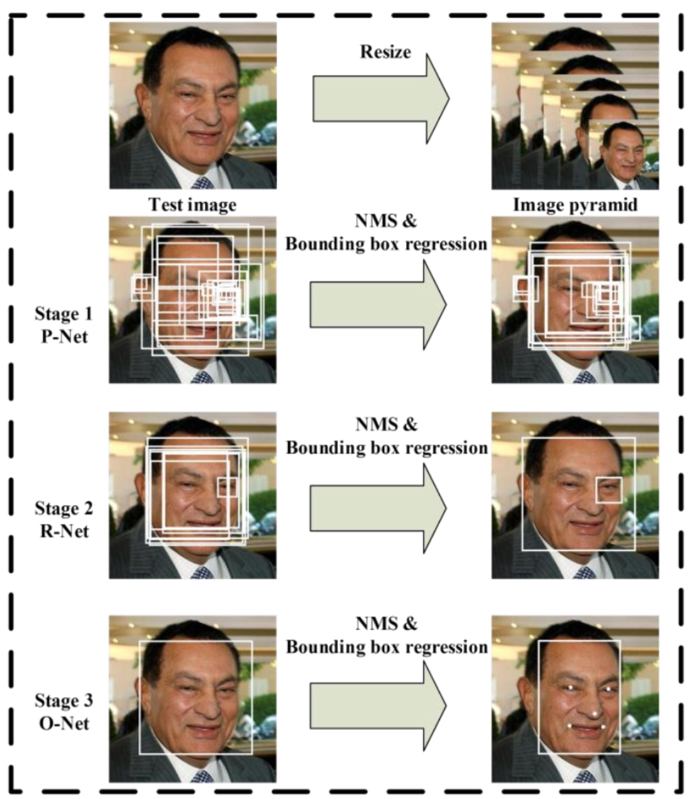
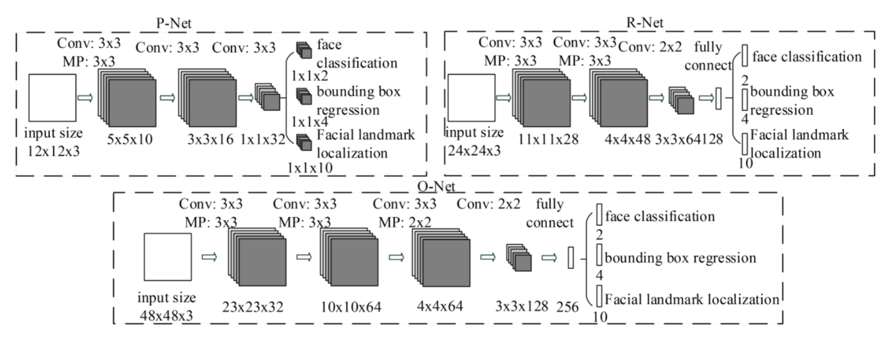
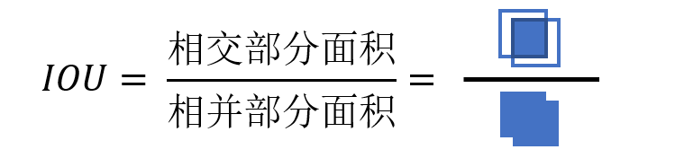
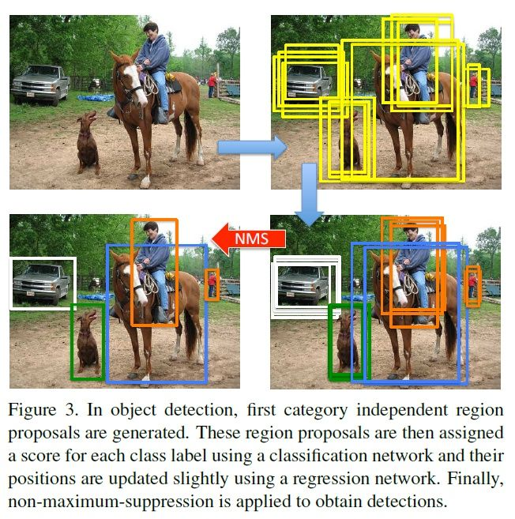

## 从零实现一篇人脸检测相关的论文

原论文参考: [Joint Face Detection and Alignment using Multi-task Cascaded Convolutional Neural Networks](https://github.com/Mrzhang3389/MTCNN/blob/master/Mtcnn_Step/参考资料/(mtcnn)Joint Face Detection and Alignment using Multi-task Cascaded Convolutional Neural Networks.pdf)

#### 整体人脸检测逻辑

将需要检测的人脸图像缩小到 P-Net R-Net O-Net模型输入的大小分别为12 24 48

然后让三个神经网络 P R O去扫描这三个尺寸的图像 (这里注意不是三个网络同时扫描)

**先将人脸图像缩小到12x12送入P网络检测人脸, 这时会得到很多人脸的建议框. 将这些人脸建议框反向计算到原图上, 然后截取原图像并缩放到24x24送入R网络再次检测人脸, 得到R网络预测的建议框, 再次将这些人脸建议框反向计算到原图上, 再次截取原图像并缩放到48x48最后送入O网络进行人脸预测.**

经过上述三个网络 逐级检测可使人脸检测率大大提升.  调节三个网络的置信度可平衡人脸检测的速度和准确率.

#### 三个网络结构的实现

以下按论文的实际数据编写, 实际操作过程中可对参数 (卷积核大小, 步长, 宽/窄卷积, 卷积核数量, 池化层大小等参数) 进行修改.

实现代码可参考: [网络结构Pytorch实现](https://github.com/Mrzhang3389/MTCNN/blob/master/Mtcnn_Step/Step/step3_Net_and_train/Three_Net.py)

1. P网络:
   - 输入层: 图像输入大小为12x12x3;  通过10个卷积核, 卷积核大小为3x3, 步长为1; 窄卷积; 然后通过一层池化层3x3
   - 第二层: 特征层为 5x5x10; 通过16个卷积核, 卷积核大小为3x3, 步长为1; 窄卷积
   - 第三层: 特征层为 3x3x16; 通过32个卷积核, 卷积核大小为3x3, 步长为1; 窄卷积
   - 第四层: 输出层为 1x1x32; 将输出层分配为1x1x2的是否为人脸的置信度输出, 1x1x4的人脸框x1y1x2y2, 1x1x10为人脸的地标
2. R网络:
   - 输入层: 图像输入大小为24x24x3;  通过28个卷积核, 卷积核大小为3x3, 步长为1; 窄卷积; 然后通过一层池化层3x3
   - 第二层: 特征层为 11x11x28; 通过48个卷积核, 卷积核大小为3x3, 步长为1; 窄卷积; 然后通过一层池化层3x3
   - 第三层: 特征层为 4x4x48; 通过64个卷积核, 卷积核大小为2x2, 步长为1; 窄卷积
   - 第四层: 特征层为 3x3x64; 将3x3x64平铺通过576x128的全链接层
   - 第五层: 输出层为 128; 将输出层分配为2为人脸的置信度输出, 4为人脸框x1y1x2y2, 10为人脸的地标
3. O网络:
   - 输入层: 图像输入大小为48x48x3;  通过32个卷积核, 卷积核大小为3x3, 步长为1; 窄卷积; 然后通过一层池化层3x3
   - 第二层: 特征层为 23x23x32; 通过64个卷积核, 卷积核大小为3x3, 步长为1; 窄卷积; 然后通过一层池化层3x3
   - 第三层: 特征层为 10x10x64; 通过64个卷积核, 卷积核大小为3x3, 步长为1; 窄卷积; 然后通过一层池化层2x2
   - 第四层: 特征层为 4x4x64; 通过128个卷积核, 卷积核大小为2x2, 步长为1; 窄卷积
   - 第五层: 特征层为 3x3x128; 将3x3x128平铺通过1152x256的全链接层
   - 第六层: 输出层为 256; 将输出层分配为2为人脸的置信度输出, 4为人脸框x1y1x2y2, 10为人脸的地标

#### 构造损失函数的IOU概念

概念: IOU用于评价 标注框和预测框的重合度, 重合度越高IOU的值越接近1, 重合度越低IOU的值越接近0 (完全不想交 或者 预测框远远大于标注框)

IOU: 交并比, 标注框和预测框的交集 比上 标签框和预测框的并集

实现代码可参考: [IOU实现(Python版)](https://github.com/Mrzhang3389/MTCNN/blob/master/Mtcnn_Step/Step/step2_Tool_and_data/tool/IOU.py)

#### 三个网络筛选预测框 使用NMS

概念: 使用神经网络扫描图像预测对象的时候, 对象周围会出现较多的堆叠的建议框.  这时我们需要找出框的最正最好的建议框, 怎么找出来呢, 这时可以使用NMS算法.

1. 将所有的框按类别划分, 并剔除背景类, 因为无需NMS.
2. 对每个物体类中的建议框(B_BOX), 按照分类置信度降序排列.
3. 在某一类中, 选择置信度最高的边界框B_BOX1, 将B_BOX1从输入列表中去除, 并加入输出列表.
4. 逐个计算B_BOX1与其余B_BOX2的交并比IOU, 若IOU(B_BOX1, B_BOX2) > 阈值Threshold, 则在输入去除B_BOX2.
5. 重复步骤3~4，直到输入列表为空，完成一个物体类的遍历。
6. 重复2~5，直到所有物体类的NMS处理完成。
7. 输出列表，算法结束

实现代码可参考: [NMS实现(Python版)](https://github.com/Mrzhang3389/MTCNN/blob/master/Mtcnn_Step/Step/step2_Tool_and_data/tool/NMS.py)

#### 数据采样

伪造比较符合神经网络检测人脸时能遇到的数据用于训练模型

为三个神经网络分别伪造 正样本 中等样本 负样本 ((正样本 iou>0.65, 负样本 iou<0.3, 中等样本 0.65 > iou > 0.4))

- 图象中包含人脸 且iou>0.65的为正样本 表示该图像中有人脸
- 图像中包含人脸 但0.65 > iou > 0.4为中等样本 表示该图像中有人脸但是面积不大
- 图像中包含人脸 但iou<0.3为负样本 表示该图象中有人脸但是所含面积极小

实现代码可参考: [数据采样](https://github.com/Mrzhang3389/MTCNN/blob/master/Mtcnn_Step/Step/step2_Tool_and_data/data/Data_processing.py)

#### 用整体人脸检测的逻辑合并以上每个模块的代码

这时我们拥有以下模块的代码:

1. 三个神经网络结构的代码 (P-Net, R-Net, O-Net)
2. IOU的代码
3. NMS的代码
4. 分别为三个网络 采样的 正样本数据 中等样本数据 和 负样本数据

然后我们分别使用为三个网络采样的数据 单独训练每个网络 P R O即可得到三个网络的模型权重.

调节模型的训练参数等, 使模型训练的更好.

实现代码可参考: [训练代码](https://github.com/Mrzhang3389/MTCNN/blob/master/Mtcnn_Step/Step/step3_Net_and_train/trainer2.py)

最后将三个网络结构串联起来, 逐级对人脸图像进行预测. 即实现了人脸的检测任务

调节模型使用的置信度的阈值, 即可平衡模型的性能和召回率.

实现代码可参考: [使用代码](https://github.com/Mrzhang3389/MTCNN/blob/master/Mtcnn_Step/Step/step4_Test_and_use/useNet2.py)

#### 最后效果图

如有侵犯肖像权联系我删除. [zhanghao_3389@163.com](mailto:zhanghao_3389@163.com)

